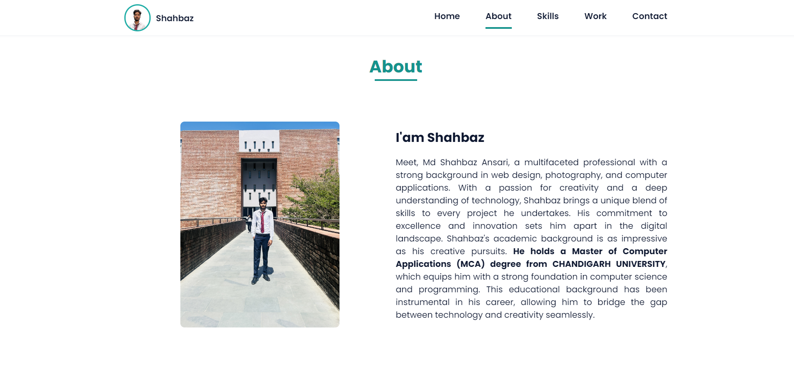
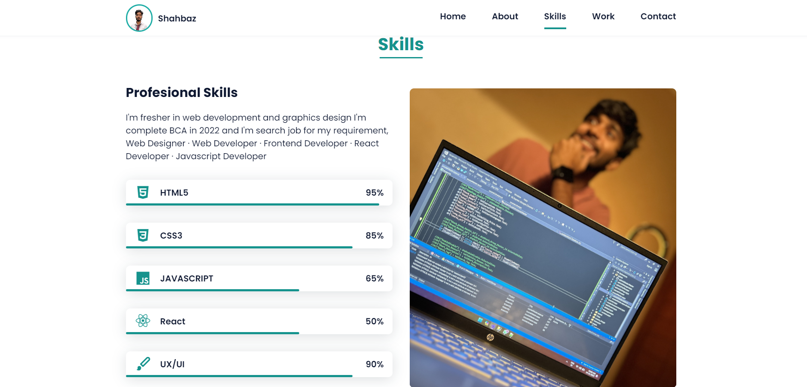
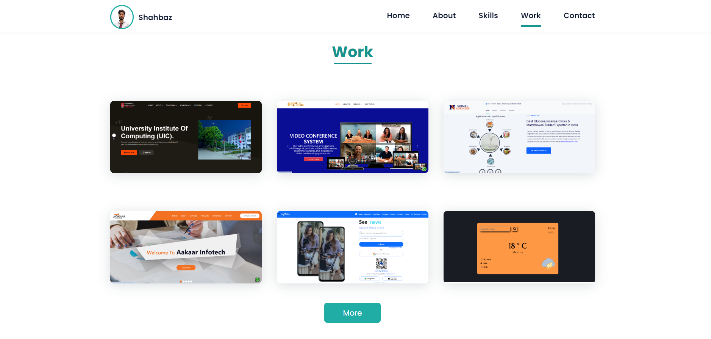
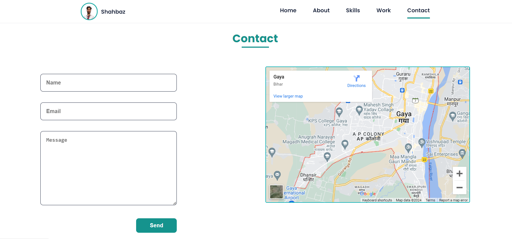

-----This is My Task Week-2 For @Campus_Valley-----

# Portfolio Responsive Complete
## [Watch it on youtube](https://www.youtube.com/channel/UCdPcN2ibTMK5adKU3baLcOA)
### Portfolio Responsive Complete

- Responsive Personal Portfolio Website HTML CSS & JavaScript.
- Contains animations when scrolling.
- Smooth scrolling in each section.
- Developed first with the Mobile First methodology, then for desktop.
- Compatible with all mobile devices and with a beautiful and pleasant user interface.

💙 Join the channel to see more videos like this. [shahbaz](https://www.youtube.com/channel/UCdPcN2ibTMK5adKU3baLcOA)

portfolio Live Link: https://mdshahbazansari.github.io/Portfolio-shahbaz/

